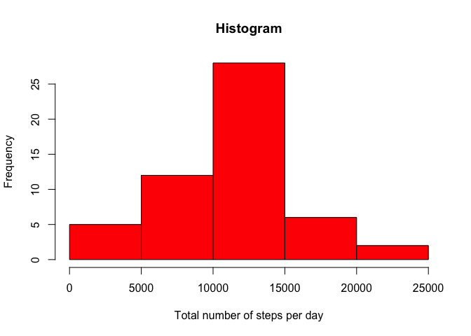
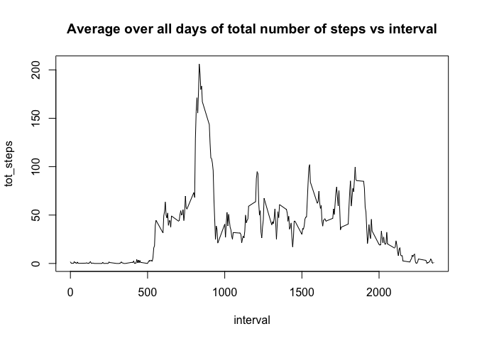
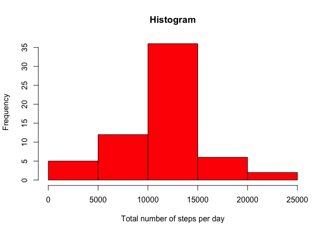
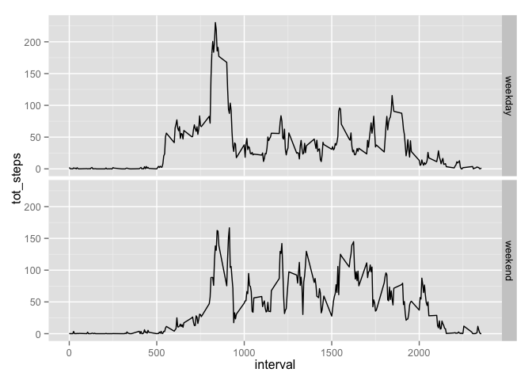

# Reproducible Research: Peer Assessment 1
## Loading and preprocessing the data

```r
df = read.csv("./activity.csv", stringsAsFactors = FALSE)
```

## What is mean total number of steps taken per day?
###Histogram of total numbers of steps per day

```r
# remove tuples that have steps = NA
df_naremoved = df[which( !is.na(df$steps) ), ]
# sum over steps in the same day:
histo = aggregate(df_naremoved$steps, by = list(df_naremoved$date), FUN = sum) 
# rename column just to be more clear:
names(histo) = c('Date', 'tot_steps')
# plot the histogram:
hist(histo$tot_steps, col = 'red', xlab = 'Total number of steps per day', main = 'Histogram')
```

 

###Mean and median of the total number of steps per day:

```r
mean(histo$tot_steps)
```

```
## [1] 10766.19
```

```r
median(histo$tot_steps)
```

```
## [1] 10765
```

## What is the average daily activity pattern?
###Time series plot:

```r
data = aggregate(df_naremoved$steps, by = list(df_naremoved$interval), FUN = mean)
names(data) = c('interval', 'tot_steps')
plot(data$interval, data$tot_steps, type = 'l', xlab = 'interval', ylab = 'tot_steps', main = 'Average over all days of total number of steps vs interval')
```

 

###Interval with the maximun number of steps:

```r
data[ which( data$tot_steps == max(data$tot_steps) ), 'interval']
```

```
## [1] 835
```

## Imputing missing values

```r
length( df[which(is.na(df$steps)), 1] )
```

```
## [1] 2304
```

```r
# create new data frame with NA replaced by 'mean for 5-minute interval'
df_nafilled = df
for( x in data$interval ) {
    sost = data[ which(data$interval == x), "tot_steps"]
    df_nafilled[which( is.na(df_nafilled$steps) & df_nafilled$interval==x ), "steps"] = sost
}
```

###Histogram of total numbers of steps per day

```r
# sum over steps in the same day:
histo2 = aggregate(df_nafilled$steps, by = list(df_nafilled$date), FUN = sum) 
# rename column just to be more clear:
names(histo2) = c('Date', 'tot_steps')
# plot the histogram:
hist(histo2$tot_steps, col = 'red', xlab = 'Total number of steps per day', main = 'Histogram')
```

 

###Mean and median of the total number of steps per day:

```r
mean(histo2$tot_steps)
```

```
## [1] 10766.19
```

```r
median(histo2$tot_steps)
```

```
## [1] 10766.19
```

## Are there differences in activity patterns between weekdays and weekends?

```r
# set US localTime in order to have days name in english
Sys.setlocale("LC_TIME", "en_US")
```

```
## [1] "en_US"
```

```r
# convert the date to type POSIXlt
ndf = df_nafilled
ndf$date = strptime(ndf$date, format = "%Y-%m-%d")

# add factor variable to the data frame
wdt = c('Monday', 'Tuesday', 'Wednesday', 'Thursday', 'Friday')
wdf = c('Saturday', 'Sunday')
ndf$type_day = factor( weekdays(ndf$date) %in% wdt, levels = c(TRUE, FALSE), labels = c('weekday', 'weekend') )

# generate two separate data frame related to the two different value of the factor variable type_day
d1 = ndf[which(ndf$type_day == 'weekday'), ]
d2 = ndf[which(ndf$type_day == 'weekend'), ]

# prepare data to plot: aggregte data of the same interval by taking the mean over all day
data1 = aggregate(d1$steps, by = list(d1$interval), FUN = mean)
data1$type_day = "weekday"
names(data1) = c('interval', 'tot_steps', 'type_day')

data2 = aggregate(d2$steps, by = list(d2$interval), FUN = mean)
data2$type_day = "weekend"
names(data2) = c('interval', 'tot_steps', 'type_day')

# bind the two data  frame ready to be plotted
d = rbind(data1, data2)

# plot the data
library(ggplot2)
qplot(interval, tot_steps, data = d, facets = type_day~., geom = 'line')
```

 
